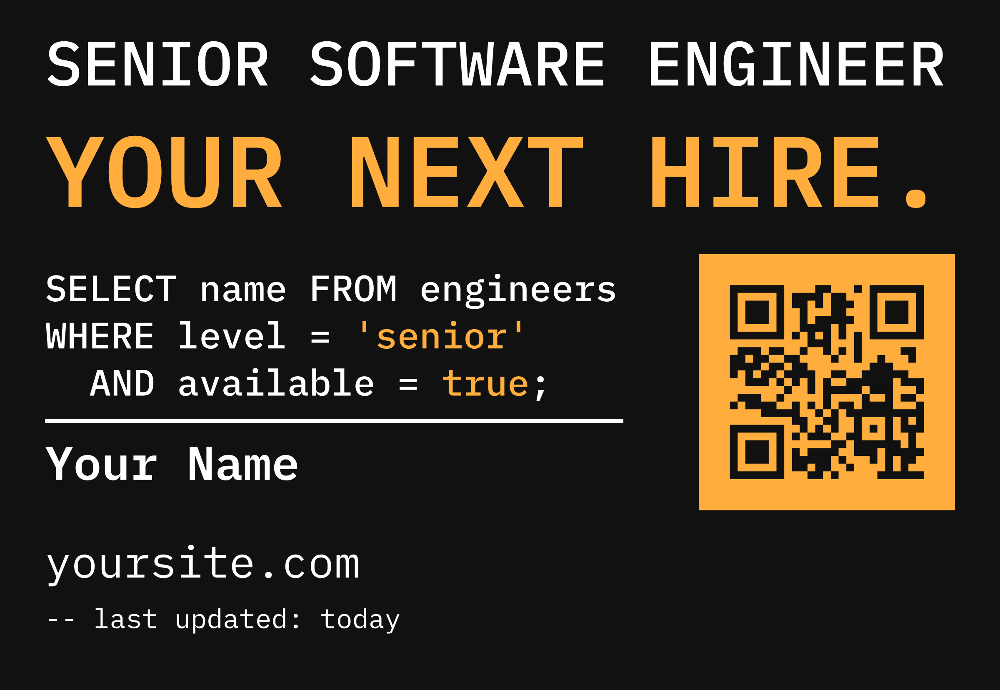

# select-me

Type your name, your job title and a link. Get print-ready shirt artwork — vector
files, a 300 DPI raster, and a specification sheet your printer will not have to
email you about.

**[selectme.vercel.app](https://selectme.vercel.app)** · `npx select-me`



---

## Why this exists

I designed one shirt to wear to interviews. People asked for their own, and a
design that only works for one person is a worse design than one that works for
everyone. So I measured the original artwork, worked out the rules behind it, and
rebuilt it as a generator.

One rule turned out to govern the whole layout: **every automatically sized line
fills 99% of its column.** That 1% is why the last letter never touches the trim
edge. The kicker, the code block and the chest line all land on it exactly.

The test suite regenerates my original shirt from those rules and compares it to
the original file, edge by edge. It passes to within 0.01 mm.

## What you get

| File | Format | Placement |
| --- | --- | --- |
| `back-print-270mm` | SVG, PDF, PNG | 270 × 182 mm, centred, 82 mm below the collar seam |
| `front-chest-100mm` | SVG, PDF, PNG | 100 × 20 mm, left chest, deliberately off-centre |
| `PRINT-SPEC.pdf` | PDF | Placement, inks, and the one warning that matters |
| `README.txt` | Text | The same instructions, for whoever opens the folder first |

Everything is at exact final size. Nothing needs scaling.

### Made for an actual press

- **Two inks, never more.** Every mark is one of two colours, so a screen printer
  burns two screens per placement instead of matching a gradient.
- **Real CMYK.** The PDFs carry CMYK fills and a Pantone reference, not a
  screen-RGB guess a RIP has to interpret.
- **Type is outlined.** Every character is a filled contour. No font to install,
  nothing to substitute — the most common way artwork arrives wrong.
- **The QR is a knockout.** Its dark modules are unprinted and the garment shows
  through. The spec sheet says so in the largest words on the page, because
  filling them in is the one mistake that stops the code scanning.
- **Any ink you like.** Six presets carry measured CMYK and a Pantone reference;
  any other hex is converted and labelled as converted, so nobody mistakes a
  screen colour for a matched one. A dark accent on a dark shirt gets a warning.

### The QR does not have to match the printed link

Leave it alone and the code points at the link printed under your name — that is
how the original works. Set it separately and the printed line can stay readable
while scans go somewhere longer: a booking page, a CV, a tracked URL. The tool
tells you what the code will actually open before you download anything.

## Use it

### In a browser

[selectme.vercel.app](https://selectme.vercel.app). Everything runs client-side: the fonts,
the outlining, the QR, the PDF writer. There is no server, no account and no
upload, which is not a privacy policy so much as an architecture.

### On the command line

```sh
npx select-me
```

Run with no arguments and it asks for the three things it needs. Or pass them:

```sh
npx select-me \
  --name "Ada Lovelace" \
  --title "Staff Data Scientist" \
  --url "ada.dev/hire" \
  --qr "https://cal.com/ada/30min" \
  --sort \
  --accent "#2ED3B7" \
  --out ./artwork
```

`--help` lists everything. The CLI writes SVG and PDF; PNG needs a canvas, so it
comes out of the web tool.

### As a library

```sh
npm install select-me
```

```js
import { readFile } from 'node:fs/promises';
import { DEFAULTS, layout, loadFonts, toSvg, toPdf } from 'select-me';

const fonts = await loadFonts(async (file) => {
  const buf = await readFile(new URL(`./node_modules/select-me/assets/fonts/${file}`, import.meta.url));
  return buf.buffer.slice(buf.byteOffset, buf.byteOffset + buf.byteLength);
});

const design = layout({ ...DEFAULTS, name: 'Ada Lovelace', title: 'Staff Data Scientist' }, fonts);

const svg = toSvg(design.back, design.palette);   // string
const pdf = await toPdf(design.back, design.palette); // Uint8Array, CMYK
design.metrics; // { queryMm: 10.89, qrModules: 29, inks: 2, ... }
design.warnings; // things the layout had to do to make your input fit
```

`layout()` returns plain data. The renderers take that data and nothing else,
which is why the SVG, the PDF and the PNG cannot drift apart.

## How the layout works

The design is a grid of fixed baselines and one sizing rule.

```
  0 ┌───────────────────────────────────────────────────┐
 14 │ TITLE, fitted to the full 270 mm                  │
 50 │ HEADLINE, fitted to the full 270 mm               │
    │                                                   │
 78 │ SELECT name FROM engineers          ┌───────────┐ │
 92 │ WHERE level = 'senior'              │           │ │
106 │   AND available = true;             │  QR tile  │ │
    │ ( ORDER BY fit DESC LIMIT 1; )      │   76 mm   │ │
113 │ ───────────────────────             └───────────┘ │
131 │ Your Name                                         │
    │                                                   │
160 │ your-link.example                                 │
175 │ -- last updated: today                            │
182 └───────────────────────────────────────────────────┘
    0                                  171.6   194   270
```

The sort line is optional. With it on, the rule and the name hang off it
instead — one line lower — while the link and the comment stay anchored to the
bottom edge. Nothing else moves, and the trim size never changes.

Baselines never move. Type sizes are computed:

- **Display lines** (title, headline) fill the full 270 mm trim width.
- **The query** takes one size for all three lines — a code block with mixed
  sizes is not a code block — set from the longest line against the 171.6 mm
  column.
- **Name, link and comment** have nominal sizes (14, 13 and 8 mm) and only ever
  shrink, so a short name stays bold and a long one still fits.

Because the family is monospaced, all of this is arithmetic rather than
measurement: a line of *n* characters occupies `n × 0.6 em`, so the size that
fills a column is `0.99 × column ÷ (n × 0.6)`.

Width is not the only constraint. Because the baselines are fixed, a short
title fitted to 270 mm would set big enough to climb off the top of the
artwork — `CTO` wants to set at 148 mm. So every auto-sized line is the smaller
of what its column allows and what the band above its baseline allows, and
`bounds.test.js` asserts the invariant directly: nothing the generator draws
may leave the print area, for any input.

Literals in the query print in the accent ink and everything else prints in
white. That is the entire syntax highlighter, and two inks is all a screen
printer gets.

Every identifier and literal in the statement is yours:

```
SELECT {selectColumn} FROM {table}
WHERE {field} = '{value}'
  AND {andField} = {andValue}
ORDER BY {sortBy} DESC LIMIT 1;
```

`table`, `field` and `value` default to whatever the job title implies;
the rest default to `name`, `available` and `true`. Leave any of them blank and
the default shows through. The web tool edits them in place, in the query
itself, rather than in a column of labelled boxes.

## Development

```sh
npm install
npm run fonts    # rebuild the IBM Plex Mono subsets
npm run dev      # the web tool, on :5173
npm run check    # typecheck
npm run build    # library + site
npm test
```

### The tests worth knowing about

- **`original.test.js`** regenerates the shirt this project came from and
  compares every element against the original artwork, to 0.01 mm.
- **`qr-scan.test.js`** rasterises the QR straight out of the generated path
  data, applies the even-odd rule the print file relies on, and hands it to a
  real decoder. If the knockout polarity, quiet zone or module grid is ever
  wrong, it fails before anyone pays for a screen.
- **`core.test.js`** covers the sizing rule, the query derivation, PDF structure
  (including that every xref offset points where it claims), and that no
  generated file ever contains a non-finite coordinate.

### Notes on the dependencies

There are two: [opentype.js](https://github.com/opentypejs/opentype.js) for glyph
outlines and
[qrcode-generator](https://github.com/kazuhikoarase/qrcode-generator) for the
code. The PDF writer, the ZIP writer and the path serialiser are all in this
repo — each is under 200 lines, and each replaced a dependency that would have
been larger than the whole tool.

Two things worth knowing if you work on this:

- opentype.js 2.0.0's own path serialiser emits a literal `NaN` into multi-glyph
  paths. A raster previewer skips it silently; a print RIP does not. `fonts.ts`
  serialises the commands itself.
- opentype.js publishes a CommonJS `main` and an ES `module` with different
  shapes, so Node and bundlers see different exports. `fonts.ts` reads through
  both, so nobody consuming this library has to configure anything.

## Licence

Code is MIT. IBM Plex Mono is under the SIL Open Font License 1.1, and its
licence travels with the font files in `assets/fonts`.

The design is yours to use, change and print. If you make something good with it,
I would like to see it.

— [Yazan Ali](https://yazan-ali.net/hi)
